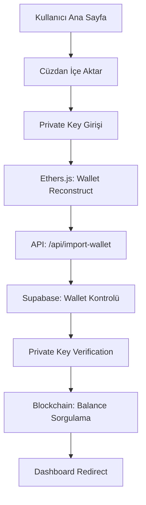
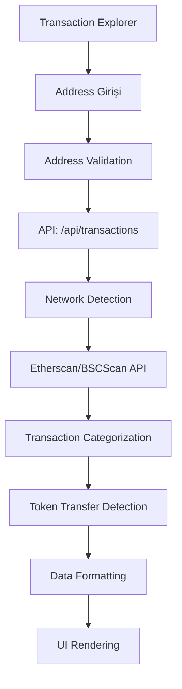

# 🚀 Web3 Wallet Application - Kapsamlı Teknik Dokümantasyon

## 📋 Proje Özeti

Bu proje, **Next.js 14 App Router**, **TypeScript**, **Supabase**, ve **Ethers.js v6** kullanılarak geliştirilmiş tam özellikli bir Web3 cüzdan uygulamasıdır. Gerçek blockchain verileri ile çalışan, güvenli ve kullanıcı dostu bir arayüz sunar.

## 🏗️ Mimari Yapı ve Teknoloji Stack'i

### **Frontend Teknolojileri**
- **Next.js 15.3.3** - React framework (App Router kullanımı)
- **React 19.0.0** - UI kütüphanesi
- **TypeScript 5.x** - Type safety ve geliştirici deneyimi
- **Tailwind CSS 4.x** - Utility-first CSS framework
- **Geist Font** - Modern tipografi (Sans & Mono)

### **Backend ve API Teknolojileri**
- **Next.js API Routes** - Serverless API endpoints
- **Supabase 2.50.0** - PostgreSQL veritabanı ve authentication
- **Ethers.js 6.14.4** - Ethereum/BSC blockchain etkileşimi
- **bcryptjs 3.0.2** - Şifre hashleme ve güvenlik

### **Blockchain Entegrasyonu**
- **BSC (Binance Smart Chain)** - Mainnet ve Testnet
- **Ethereum Mainnet** - Ethereum blockchain desteği
- **Etherscan API** - Ethereum transaction data
- **BSCScan API** - BSC transaction data
- **Binance API** - Gerçek zamanlı fiyat verileri

### **Güvenlik ve Şifreleme**
- **Base64 Encoding** - Private key storage (demo amaçlı)
- **bcrypt** - Password hashing
- **Environment Variables** - API key ve credential yönetimi
- **TypeScript** - Runtime type safety

## 🗂️ Proje Dizin Yapısı

```
wallet-app/
├── 📁 src/
│   ├── 📁 app/                    # Next.js 14 App Router
│   │   ├── 📄 layout.tsx          # Root layout component
│   │   ├── 📄 page.tsx            # Ana sayfa (Homepage)
│   │   ├── 📄 globals.css         # Global CSS styles
│   │   ├── 📁 api/                # API Routes (Serverless)
│   │   │   ├── 📁 create-wallet/  # Cüzdan oluşturma API
│   │   │   ├── 📁 import-wallet/  # Cüzdan import API
│   │   │   ├── 📁 get-balance/    # Balance sorgulama API
│   │   │   ├── 📁 transactions/   # Transaction explorer API
│   │   │   ├── 📁 portfolio/      # Portfolio data API
│   │   │   ├── 📁 test-portfolio/ # Portfolio test API
│   │   │   ├── 📁 test-bscscan/   # BSCScan test API
│   │   │   ├── 📁 deposits/       # Deposit tracking API
│   │   │   ├── 📁 monitor-wallet/ # Wallet monitoring API
│   │   │   └── 📁 webhook/        # Webhook endpoints
│   │   ├── 📁 create-wallet/      # Cüzdan oluşturma sayfası
│   │   ├── 📁 import-wallet/      # Cüzdan import sayfası
│   │   ├── 📁 dashboard/          # Cüzdan dashboard sayfası
│   │   ├── 📁 welcome/            # Hoşgeldin sayfası
│   │   └── 📁 transactions/       # Transaction explorer sayfası
│   ├── 📁 components/             # React Components
│   │   ├── 📄 Portfolio.tsx       # Portfolio component (12KB)
│   │   ├── 📄 TransactionExplorer.tsx # Transaction explorer (11KB)
│   │   └── 📄 ErrorBoundary.tsx   # Error handling component
│   ├── 📁 lib/                    # Utility Libraries
│   │   ├── 📄 blockchain.ts       # Blockchain operations (2KB)
│   │   ├── 📄 crypto.ts           # Cryptographic utilities (1.3KB)
│   │   ├── 📄 supabase.ts         # Supabase client config (457B)
│   │   ├── 📄 binance-price.ts    # Binance API integration (6.7KB)
│   │   ├── 📄 portfolio-service.ts # Portfolio data service (9.9KB)
│   │   └── 📄 transaction-service.ts # Transaction service (7.9KB)
│   └── 📁 types/                  # TypeScript Type Definitions
│       ├── 📄 database.ts         # Supabase database types
│       └── 📄 transaction.ts      # Transaction type definitions
├── 📁 public/                     # Static Assets
│   ├── 📄 next.svg                # Next.js logo
│   ├── 📄 vercel.svg              # Vercel logo
│   └── 📄 favicon.ico             # Favicon
├── 📄 package.json                # Dependencies ve scripts
├── 📄 tsconfig.json               # TypeScript configuration
├── 📄 next.config.ts              # Next.js configuration
├── 📄 tailwind.config.js          # Tailwind CSS configuration
├── 📄 postcss.config.mjs          # PostCSS configuration
├── 📄 eslint.config.mjs           # ESLint configuration
├── 📄 env.example                 # Environment variables template
├── 📄 supabase-migration.sql      # Database migration script
├── 📄 supabase-network-constraint.sql # Database constraints
├── 📄 DEPLOYMENT.md               # Deployment guide
├── 📄 TRANSACTION_EXPLORER.md     # Transaction explorer docs
└── 📄 README.md                   # Bu dosya
```

## 🔧 Detaylı Teknoloji Analizi

### **1. Next.js 14 App Router Yapısı**

**App Router Özellikleri:**
- **Server Components**: Varsayılan olarak server-side rendering
- **Client Components**: `'use client'` directive ile client-side rendering
- **API Routes**: `app/api/` dizininde serverless functions
- **Dynamic Routing**: Folder-based routing system
- **Metadata API**: SEO ve meta tag yönetimi
- **Suspense Integration**: Loading states ve error boundaries

**Kullanılan App Router Patterns:**
```typescript
// Server Component (default)
export default function ServerComponent() {
  return <div>Server rendered content</div>
}

// Client Component
'use client'
export default function ClientComponent() {
  const [state, setState] = useState()
  return <div>Client rendered content</div>
}

// API Route
export async function GET(request: NextRequest) {
  return NextResponse.json({ data: 'API response' })
}
```

### **2. Supabase Veritabanı Mimarisi**

**Database Schema:**
```sql
-- Users tablosu
CREATE TABLE public.users (
  id UUID PRIMARY KEY DEFAULT gen_random_uuid(),
  username VARCHAR(255) UNIQUE NOT NULL,
  created_at TIMESTAMP WITH TIME ZONE DEFAULT timezone('utc', now())
);

-- Wallets tablosu
CREATE TABLE public.wallets (
  id UUID PRIMARY KEY DEFAULT gen_random_uuid(),
  user_id UUID REFERENCES users(id) ON DELETE CASCADE,
  network VARCHAR(50) DEFAULT 'BSC_MAINNET',
  address VARCHAR(42) UNIQUE NOT NULL,
  private_key_encrypted TEXT NOT NULL,
  created_at TIMESTAMP WITH TIME ZONE DEFAULT timezone('utc', now()),
  CONSTRAINT network_check CHECK (network IN ('BSC_MAINNET', 'BSC_TESTNET', 'ETHEREUM', 'POLYGON', 'ARBITRUM'))
);
```

**Supabase Client Configuration:**
```typescript
// Client-side Supabase client
export const supabase = createClient<Database>(supabaseUrl, supabaseAnonKey)

// Server-side admin client
export const supabaseAdmin = createClient<Database>(
  supabaseUrl,
  process.env.SUPABASE_SERVICE_ROLE_KEY!
)
```

### **3. Ethers.js v6 Blockchain Entegrasyonu**

**Wallet Operations:**
```typescript
// Yeni cüzdan oluşturma
export function createRandomWallet(): ethers.HDNodeWallet {
  return ethers.Wallet.createRandom()
}

// Private key'den cüzdan reconstruct
export function walletFromPrivateKey(privateKey: string): ethers.Wallet {
  return new ethers.Wallet(privateKey)
}

// Blockchain balance sorgulama
export async function getWalletBalance(address: string, network: keyof typeof NETWORKS) {
  const provider = getProvider(network)
  const balanceWei = await provider.getBalance(address)
  const balanceFormatted = ethers.formatEther(balanceWei)
  
  return {
    balance: balanceWei.toString(),
    balanceFormatted: parseFloat(balanceFormatted).toFixed(6),
    symbol: networkConfig.symbol,
    network: networkConfig.name
  }
}
```

**Network Configurations:**
```typescript
export const NETWORKS = {
  BSC_MAINNET: {
    name: 'BSC Mainnet',
    rpcUrl: 'https://bsc-dataseed.binance.org/',
    chainId: 56,
    symbol: 'BNB',
    explorer: 'https://bscscan.com'
  },
  BSC_TESTNET: {
    name: 'BSC Testnet', 
    rpcUrl: 'https://data-seed-prebsc-1-s1.binance.org:8545/',
    chainId: 97,
    symbol: 'tBNB',
    explorer: 'https://testnet.bscscan.com'
  },
  ETHEREUM: {
    name: 'Ethereum Mainnet',
    rpcUrl: 'https://rpc.ankr.com/eth',
    chainId: 1,
    symbol: 'ETH',
    explorer: 'https://etherscan.io'
  }
}
```

## 🔄 Uygulama Akış Diyagramları

### **1. Cüzdan Oluşturma Akışı**

```mermaid
graph TD
    A[Kullanıcı Ana Sayfa] --> B[Yeni Cüzdan Oluştur]
    B --> C[Username/Password Girişi]
    C --> D[Form Validation]
    D --> E[API: /api/create-wallet]
    E --> F[Username Kontrolü]
    F --> G[Ethers.js: Wallet.createRandom()]
    G --> H[Blockchain: Balance Sorgulama]
    H --> I[Binance API: Fiyat Çekme]
    I --> J[Supabase: User Kayıt]
    J --> K[Supabase: Wallet Kayıt]
    K --> L[Welcome Sayfası]
    L --> M[Dashboard]
```

### **2. Cüzdan Import Akışı**



### **3. Transaction Explorer Akışı**



## 📊 API Endpoint'leri Detaylı Analizi

### **POST /api/create-wallet**
**Amaç:** Yeni BSC cüzdan oluşturma
**Teknolojiler:** Ethers.js, Supabase, Binance API
**İşlem Adımları:**
1. Username uniqueness kontrolü
2. `ethers.Wallet.createRandom()` ile cüzdan oluşturma
3. Blockchain'den gerçek balance çekme
4. Binance API'den fiyat bilgisi alma
5. Supabase'e user ve wallet kayıt
6. Base64 encoded private key döndürme

```typescript
// Request Body
{
  "username": "string",
  "password": "string", 
  "network": "BSC_MAINNET" // optional
}

// Response
{
  "address": "0x...",
  "privateKey": "0x...",
  "username": "string",
  "network": "BSC_MAINNET",
  "balance": "0.001812",
  "symbol": "BNB",
  "usdtValue": "$1.17",
  "tokenPrice": "645.53"
}
```

### **POST /api/import-wallet**
**Amaç:** Mevcut cüzdan import işlemi
**Güvenlik:** Private key verification
**İşlem Adımları:**
1. Private key format validation
2. Ethers.js ile wallet reconstruct
3. Database'de wallet existence kontrolü
4. Stored private key ile verification
5. Real-time balance fetch
6. Dashboard redirect

### **GET /api/get-balance**
**Amaç:** Gerçek zamanlı balance sorgulama
**Teknolojiler:** Ethers.js provider, Binance API
**Özellikler:**
- Multiple network support
- Real blockchain data
- USDT conversion
- Price calculation

### **GET /api/transactions**
**Amaç:** Transaction history ve categorization
**Teknolojiler:** Etherscan/BSCScan API
**Features:**
- Smart categorization (deposit/withdraw/token_transfer)
- ERC20 token detection
- Pagination support
- Multi-network support

### **GET /api/portfolio**
**Amaç:** Portfolio data ve token balances
**Teknolojiler:** BSCScan API, Binance API
**İşlem Adımları:**
1. Token transaction history çekme
2. Unique token contracts detection
3. Her token için balance sorgulama
4. Binance API'den fiyat bilgisi
5. Portfolio value calculation

## 🎨 UI/UX Tasarım Sistemi

### **Tailwind CSS Konfigürasyonu**
- **Design System:** Geist font family
- **Color Palette:** Blue/Indigo gradient theme
- **Components:** Utility-first approach
- **Responsive:** Mobile-first design
- **Dark Mode:** Automatic system preference

### **Component Hiyerarşisi**
```
RootLayout (layout.tsx)
├── Homepage (page.tsx)
├── CreateWallet (create-wallet/page.tsx)
├── ImportWallet (import-wallet/page.tsx)
├── Dashboard (dashboard/page.tsx)
│   ├── Portfolio Component
│   └── ErrorBoundary
├── Welcome (welcome/page.tsx)
└── TransactionExplorer (transactions/page.tsx)
    └── TransactionExplorer Component
```

### **State Management**
- **Client State:** React useState/useEffect hooks
- **Server State:** API calls ile data fetching
- **URL State:** Next.js router ile query parameters
- **Form State:** Controlled components

## 🔒 Güvenlik Mimarisı

### **Mevcut Güvenlik Önlemleri**
1. **Private Key Encoding:** Base64 encoding (demo amaçlı)
2. **Input Validation:** Client ve server-side validation
3. **Address Validation:** Ethers.js ile format kontrolü
4. **Error Handling:** Sensitive data leak prevention
5. **Environment Variables:** API key protection

### **Production Güvenlik Önerileri**
1. **AES-256 Encryption:** Private key şifreleme
2. **PBKDF2/Argon2:** Key derivation functions
3. **Rate Limiting:** API endpoint koruması
4. **2FA Implementation:** Multi-factor authentication
5. **Audit Logging:** Tüm işlemlerin loglanması
6. **HSM Integration:** Hardware security modules
7. **CORS Configuration:** Cross-origin request kontrolü

## 🚀 Performance Optimizasyonları

### **Frontend Optimizasyonları**
- **Dynamic Imports:** Component lazy loading
- **Suspense Boundaries:** Loading state management
- **Error Boundaries:** Graceful error handling
- **Memoization:** React.memo ve useMemo kullanımı
- **Bundle Splitting:** Next.js automatic code splitting

### **Backend Optimizasyonları**
- **API Caching:** Response caching strategies
- **Connection Pooling:** Supabase connection management
- **Pagination:** Large dataset handling
- **Debouncing:** Input validation optimization

### **Blockchain Optimizasyonları**
- **RPC Caching:** Blockchain query caching
- **Batch Requests:** Multiple API calls optimization
- **Fallback Providers:** Network redundancy

## 📈 Monitoring ve Analytics

### **Error Tracking**
- **Console Logging:** Detailed debug information
- **Error Boundaries:** React error catching
- **API Error Handling:** Comprehensive error responses
- **Validation Errors:** User-friendly error messages

### **Performance Metrics**
- **API Response Times:** Endpoint performance tracking
- **Blockchain Query Times:** RPC call performance
- **UI Loading States:** User experience metrics
- **Database Query Performance:** Supabase analytics

## 🔧 Development Workflow

### **Code Quality Tools**
- **TypeScript:** Compile-time type checking
- **ESLint:** Code linting ve style enforcement
- **Prettier:** Code formatting (implicit)
- **Git Hooks:** Pre-commit validation

### **Testing Strategy**
- **Type Safety:** TypeScript compile-time checks
- **Manual Testing:** Comprehensive test scenarios
- **API Testing:** Endpoint functionality verification
- **Browser Testing:** Cross-browser compatibility

### **Deployment Pipeline**
1. **Development:** `npm run dev` local development
2. **Build:** `npm run build` production build
3. **Type Check:** `npx tsc --noEmit` type validation
4. **Lint:** `npm run lint` code quality check
5. **Deploy:** Vercel/Netlify automatic deployment

## 🌐 Network ve API Entegrasyonları

### **Blockchain Networks**
- **BSC Mainnet:** Primary network (Chain ID: 56)
- **BSC Testnet:** Testing network (Chain ID: 97)
- **Ethereum Mainnet:** Secondary network (Chain ID: 1)

### **External API'ler**
- **Binance API:** Real-time price data
- **BSCScan API:** BSC transaction data
- **Etherscan API:** Ethereum transaction data
- **RPC Providers:** Blockchain data access

### **API Rate Limiting**
- **Binance API:** 1200 requests/minute
- **BSCScan API:** 5 calls/second
- **Etherscan API:** 5 calls/second
- **RPC Endpoints:** Provider-specific limits

## 📱 Responsive Design

### **Breakpoints**
- **Mobile:** 320px - 768px
- **Tablet:** 768px - 1024px
- **Desktop:** 1024px+

### **Mobile Optimizations**
- **Touch-friendly:** Button sizes ve spacing
- **Readable Text:** Font sizes ve contrast
- **Fast Loading:** Optimized images ve assets
- **Offline Handling:** Network error states

## 🔄 Data Flow Architecture

### **Client-Server Communication**
```
Client (React) ↔ API Routes (Next.js) ↔ Supabase (PostgreSQL)
                        ↕
                Blockchain (Ethers.js) ↔ RPC Providers
                        ↕
                External APIs (Binance, BSCScan, Etherscan)
```

### **State Management Flow**
```
User Input → Form Validation → API Call → Database/Blockchain → Response → UI Update
```

## 🛠️ Kurulum ve Çalıştırma

### **Gereksinimler**
- Node.js 18+
- npm veya yarn
- Supabase account
- API keys (Binance, BSCScan, Etherscan)

### **Kurulum Adımları**
```bash
# 1. Repository clone
git clone <repository-url>
cd wallet-app

# 2. Dependencies install
npm install

# 3. Environment variables setup
cp env.example .env.local
# .env.local dosyasını düzenleyin

# 4. Database migration
# Supabase SQL editor'da supabase-migration.sql çalıştırın

# 5. Development server
npm run dev
```

### **Environment Variables**
```env
# Supabase
NEXT_PUBLIC_SUPABASE_URL=https://your-project.supabase.co
NEXT_PUBLIC_SUPABASE_ANON_KEY=your_anon_key
SUPABASE_SERVICE_ROLE_KEY=your_service_role_key

# Blockchain RPC
BSC_RPC_URL=https://bsc-dataseed.binance.org/
BSC_TESTNET_RPC_URL=https://data-seed-prebsc-1-s1.binance.org:8545/
ETHEREUM_RPC_URL=https://rpc.ankr.com/eth

# API Keys
ETHERSCAN_API_KEY=your_etherscan_key
BSCSCAN_API_KEY=your_bscscan_key
```

## 📚 Ek Dokümantasyon

- **[DEPLOYMENT.md](./DEPLOYMENT.md)** - Deployment guide
- **[TRANSACTION_EXPLORER.md](./TRANSACTION_EXPLORER.md)** - Transaction explorer documentation
- **[supabase-migration.sql](./supabase-migration.sql)** - Database schema
- **[env.example](./env.example)** - Environment variables template

## 🤝 Katkıda Bulunma

1. Fork the repository
2. Create feature branch (`git checkout -b feature/amazing-feature`)
3. Commit changes (`git commit -m 'Add amazing feature'`)
4. Push to branch (`git push origin feature/amazing-feature`)
5. Open Pull Request

## 📄 Lisans

Bu proje MIT lisansı altında lisanslanmıştır.

## 🔗 Faydalı Linkler

- [Next.js Documentation](https://nextjs.org/docs)
- [Ethers.js Documentation](https://docs.ethers.org/v6/)
- [Supabase Documentation](https://supabase.com/docs)
- [Tailwind CSS Documentation](https://tailwindcss.com/docs)
- [BSCScan API Documentation](https://docs.bscscan.com/)
- [Etherscan API Documentation](https://docs.etherscan.io/)

---

**Not:** Bu uygulama eğitim ve demo amaçlı geliştirilmiştir. Production kullanımı için ek güvenlik önlemleri alınmalıdır.
